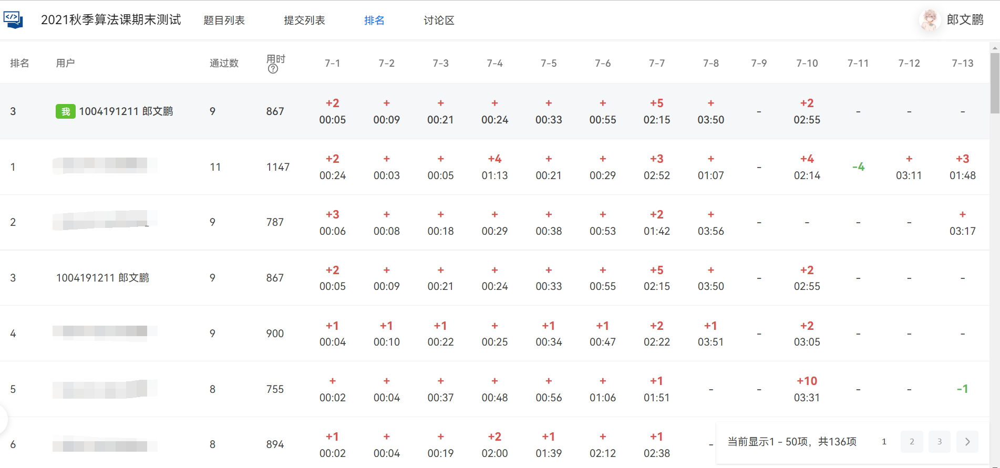

## 📂作业信息

```cpp
/***
 * @author: pengpenglang
 * @date: 2021-10-28
 * @language: cpp
 * @info: 大三上 算法设计与分析
 */
```

## 🏷️作业说明

### 📚平常作业

- 复杂度分析（手算递归复杂度）
- 堆排序
- 分治减治（7选3必选、1选做）
  - PTA【7-2】[国王的奖励](https://pintia.cn/problem-sets/1437953294004183040/problems/1442835823306747904)
  - PTA【7-5】[铺设油井管道](https://pintia.cn/problem-sets/1437953294004183040/problems/1442837809221611520)
  - PTA【7-7】[数的三次方根](https://pintia.cn/problem-sets/1437953294004183040/problems/1442837809225805825)
  - 洛谷【P1429】[最近点对](https://www.luogu.com.cn/problem/P1429)
- 动态规划（多段图最短路、01背包）
- 动态规划（K近似匹配、最优二叉查找树）
- 贪心法（01背包问题、TSP问题、Kruskal求MST）
- 回溯法（n皇后问题、寻找答案集合、迷宫问题）
  - 递归版
  - 非递归版
- 分支限界法（TSP问题、任务分配问题、背包问题）
- 作业题目讲解（PTA【7-22】 [牛牛坤卖手镯Ⅱ](https://pintia.cn/problem-sets/1437953294004183040/problems/1453903730214899718)）

### 📝期末报告

**要求**：【必做】TSP问题/01背包问题二选一【选做】数独问题

- 必做问题使用蛮力法、动态规划法、贪心法、回溯法、分支限界法分别求解并比较分析
- 选做问题使用回溯法

> 📣好消息：博主当时处于卷绩点时代，本项目中报告三个都实现啦~😛

```
code/
|-- 01beg
|   |-- 10thing.txt 样例一：10个物品
|   |-- 20thing.txt 样例二：20个物品
|   |-- 50thing.txt 样例三：50个物品
|   |-- 5thing.txt  样例四：5个物品 
|   |-- backtrack.cpp 回溯法求解
|   |-- branchbound.cpp 分支限界法求解
|   |-- bruteforce.cpp 暴力法求解
|   |-- dp.cpp 动态规划法求解
|   |-- greedy.cpp 贪心法求解
|   `-- random.cpp 随机生成样例
|-- sudoku
|   |-- in1.txt 样例一
|   |-- in2.txt 样例二
|   |-- in3.txt 样例三
|   |-- random.cpp 随机生成样例
|   `-- trackback.cpp 回溯法求解
`-- tsp 
    |-- 10city.txt 样例一：10个城市
    |-- 20city.txt 样例二：20个城市
    |-- 50city.txt 样例三：50个城市
    |-- 5city.txt 样例四：5个城市
    |-- backtrack.cpp 回溯法求解
    |-- branchbound.cpp 分支限界法求解
    |-- bruteforce.cpp 暴力法求解
    |-- dp.cpp 动态规划法求解
    |-- greedy.cpp 贪心法求解
    `-- random.cpp 随机生成样例
```

### ⌨️[期末上机考试](https://pintia.cn/problem-sets/1463468254193881088)

**规则**：ICPC赛制，使用PTA平台在大机房B101B进行4个小时的个人算法比赛，共13道题目。难度简单（CF1400左右），成功拿下！



## 🧩内容截图

